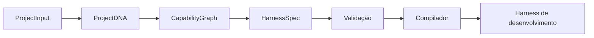

# AI Harness Compiler

**Compile project intent into typed, verifiable, project-specific AI engineering harnesses.**

Um meta-pipeline de AI Engineering cujo produto é a estrutura de engenharia de IA
de um novo projeto: arquitetura, contexto, políticas, prompts, skills, ferramentas,
workflows, avaliações e critérios de evolução.

O projeto parte de **branding + backlog + concepção + assets + restrições** e usa
representações intermediárias verificáveis antes de gerar qualquer artefato.
O compilador é generalista: nicho e regras são estudados por projeto; exemplos de
educação/comércio são fixtures, e packs opcionais não limitam os domínios atendidos.

**Status: fundação v0.1.** O repositório contém um compilador local determinístico
de um harness de desenvolvimento. O pipeline completo de IA está no roadmap.

Foco atual: [Sprint 2.5 — qualidade semântica e modelo local](docs/delivery/sprint-2-5.md),
com evals, grounding e qualificação antes de avançar no blueprint.



## Começar

Requisitos: Python 3.12+ e [uv](https://docs.astral.sh/uv/getting-started/installation/).
Não são necessárias credenciais, modelos ou serviços externos para executar o exemplo.

```sh
uv sync --locked
uv run factory validate examples/project-definition
uv run factory build examples/project-definition --output output/learning-studio
uv run python output/learning-studio/.ai/hooks/verify_artifacts.py
```

O diretório de saída deve ser novo. Para repetir o build, escolha outro diretório.
O compilador exporta artefatos; ainda não instala ou mescla alterações em outro repo.

Para revisar a representação intermediária antes da compilação:

```sh
uv run factory plan examples/project-definition
uv run factory compile output/learning-studio/.ai/harness.json --output output/reviewed
uv run factory schema harness-spec
uv run factory tasks project-definition --select ahc-001 ahc-002 ahc-003 ahc-004
```

`plan` e `schema` imprimem JSON em stdout. A entrada atual é um `project.yaml`
estruturado. Consulte o [exemplo](examples/project-definition/project.yaml) e o
[contrato de entrada](docs/contracts.md) antes de criar seu manifesto.

## O que funciona agora

- Contratos Pydantic e JSON Schema: `ProjectInput`, `ProjectDNA`, `CapabilityGraph`, `HarnessSpec`.
- Preservação de branding, restrições, backlog, referências a assets e domínio declarado.
- Registro de evidências e incógnitas, incluindo `DOMAIN_UNCERTAIN`.
- Perfil multidimensional fornecido, com hipóteses, origem, dados e riscos; [contrato](docs/engineering/domain-profile.md).
- Preparação e validação de propostas de entendimento com snapshot/citações/revisão; [contratos](docs/engineering/project-understanding.md).
- Estudo explícito com adapter opcional Ollama, sem aprovação automática; [operação e limites](docs/engineering/ollama-understanding.md). Demonstração semântica com modelo real ainda pendente.
- Evidence Pack com fontes, digest canônico, revisão declarada e escopos; [contrato e migração](docs/engineering/evidence-pack.md).
- Validação de IDs, dependências, ciclos, referências e cobertura de critérios de aceitação.
- Geração reproduzível de `AGENTS.md`, contexto, políticas, ADRs, plano de trabalho,
  plano de evals, documentação, manifesto de hashes e CI de integridade.
- CLI, testes, análise estática, lockfile e CI para Linux e Windows.
- Fixtures de três domínios, diagnósticos de escrita e [benchmark offline medido](docs/engineering/compiler-reliability.md).
- Decomposição determinística em TaskGraph, com critérios e gates de dependências.
- Equipe opcional de seis especialistas com personas, ferramentas, LangGraph,
  checkpoints do PO e ML local. Consulte [agentes do projeto](docs/engineering/project-agents.md).
- Memória de engenharia com DE/DOC/ADR, incidentes, lições, procedimentos e experimentos,
  revisões persistentes, busca SQLite e recuperação por evidência e escopo.

**Limites dos harnesses compilados:** inferência de domínio, parsing de documentos
livres, pesquisa, integrações MCP, execução de agentes gerados, simulação,
instalação e autoevolução continuam no roadmap. Assets são referências, sem leitura de conteúdo.
As avaliações do produto gerado são planos `not-run`, e não testes aprovados.
As políticas emitidas são contratos de desenvolvimento; um Policy Engine de runtime
será necessário para aplicá-las durante a execução de agentes.

## Artefatos gerados

```text
output/learning-studio/
├── AGENTS.md
├── .gitattributes
├── .github/workflows/harness.yml
├── .ai/
│   ├── project-dna.json
│   ├── capability-graph.json
│   ├── harness.json
│   ├── evidence/pack.json
│   ├── manifest.json
│   ├── context/registry.json
│   ├── policies/permissions.json
│   ├── workflows/development.json
│   ├── workflows/task-graph.json
│   ├── evals/plan.json
│   ├── hooks/verify_artifacts.py
│   └── observability/README.md
└── docs/
    ├── harness.md
    └── architecture/adr-001.json
```

Os formatos de renderização são estáveis; o modelo, as dependências, os critérios,
as restrições e os registros de contexto vêm do projeto. A v0.1 ainda usa uma única
arquitetura baseline. Síntese específica de prompts, skills e agentes virá depois
dos contratos correspondentes e da avaliação de alternativas.

## Estrutura do compilador

```text
src/ai_harness_compiler/
├── models/          # Contratos e invariantes da IR
├── intake.py        # Manifesto YAML → ProjectInput
├── pipeline.py      # Transformações puras → HarnessSpec
├── planning.py      # CapabilityGraph → TaskGraph verificável
├── compiler.py      # Renderização e exportação
└── cli.py           # Interface factory
schemas/            # JSON Schemas gerados dos modelos
tests/              # Contratos, pipeline, compilação, integridade e CLI
examples/           # Projeto fictício executável
project-definition/ # Backlog canônico do próprio compilador
planning/           # Sprint proposta e tarefas geradas
docs/               # Visão, arquitetura, contratos, ADRs e roadmap
knowledge/          # Critérios para futura base de conhecimento
scripts/            # Regeneração de schemas e políticas do próprio repo
.github/            # CI, Dependabot e templates de colaboração
```

## Desenvolvimento

```sh
uv run ruff check .
uv run ruff format --check .
uv run mypy src
uv run pytest
uv run python scripts/export_schemas.py --check
uv run python scripts/generate_repo_agents.py --check
uv run python scripts/generate_sprint_plan.py --check
uv run factory memory check
uv run factory memory index --check
uv build
```

Para desenvolver e testar a equipe opcional, instale todos os extras:

```sh
uv sync --locked --all-extras
uv run --extra team factory team run project-definition --output output/pre-sprint-team
```

Leia [CONTRIBUTING.md](CONTRIBUTING.md). O core pertence ao projeto e permanece
independente de provedores de modelos e frameworks de agentes.

## Documentação

| Documento | Conteúdo |
|---|---|
| [Visão do produto](docs/vision.md) | Objetivo, princípios e pipeline completo |
| [Arquitetura v0](docs/architecture.md) | Planos, fronteiras e stack planejada |
| [Contratos](docs/contracts.md) | Schemas, invariantes e compatibilidade |
| [Roadmap](docs/roadmap.md) | Fases e critérios de conclusão |
| [ADRs](docs/adr/0001-compiler-first.md) | Decisões iniciais |
| [Setup do GitHub](docs/github-setup.md) | Nome, description, topics e publicação |
| [Segurança](SECURITY.md) | Fronteiras atuais e reporte de falhas |
| [Concepção](docs/product/conception.md) | Usuários, hipóteses e Product Goal |
| [Backlog](docs/product/backlog.md) | 18 histórias priorizadas e critérios canônicos |
| [Kickoff](docs/delivery/kickoff.md) | Agenda e decisões para iniciar |
| [Scrum e DoD](docs/delivery/scrum.md) | Acordo de trabalho e conclusão |
| [Sprint 1](docs/delivery/sprint-1.md) | Objetivo, escopo proposto e 16 tarefas |
| [Task planning](docs/engineering/task-planning.md) | Decomposição implementada e limites |
| [Commits e branches](docs/engineering/workflow.md) | Convenções verificadas por hook e CI |
| [Engenharia](docs/engineering/standards.md) | Organização, qualidade e escalabilidade |
| [Agentes do projeto](docs/engineering/project-agents.md) | Equipe executável, ML e decisão do PO |
| [Memória de engenharia](docs/engineering/memory-system.md) | Documentação permanente, erros, soluções e aprendizagem |
| [Geração por projeto](docs/product/project-generation-pipeline.md) | Memória e agentes especializados como produto do pipeline |

## Licença

[Apache-2.0](LICENSE), com atribuições em [NOTICE](NOTICE).
Leia a [política de licenciamento](docs/engineering/licensing.md) para o tratamento
de dependências, conteúdo de terceiros e artefatos gerados.
