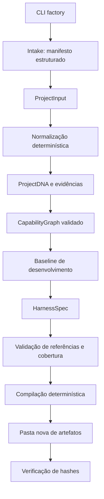

# Arquitetura técnica v0

## Fronteiras do sistema

Direção do produto: [entendimento generalista](product/generalist-pipeline.md)
antes da síntese específica. O pipeline abaixo descreve a baseline determinística
atual; estudo semântico/modelos e seleção de packs serão introduzidos por AHC-019/020.

`models/` define os contratos. `pipeline.py` contém transformações puras.
`intake.py` e `compiler.py` são fronteiras de I/O. `cli.py` compõe as etapas.
O comando `compile` aceita a IR serializada sem reexecutar intake ou planejamento.

`planning.py` transforma CapabilityGraph em TaskGraph/v1. O comando `tasks` permite
selecionar capacidades para uma sprint, com gates e critérios preservados. O plano
é estrutural e determinístico, sem executor ou decomposição semântica via LLM.

O build não lê assets, executa código gerado, chama subprocessos, usa rede ou
instala o resultado. Ele valida a IR antes de criar a saída e recusa qualquer
diretório existente. Uma falha de disco durante a emissão pode deixar uma saída
parcial; use uma nova pasta na próxima tentativa. Publicação transacional e
instalação incremental pertencem a fases posteriores.
AHC-004 adiciona códigos de falha, manifesto emitido por último e benchmark offline
com integridade em processo. Ver [confiabilidade](engineering/compiler-reliability.md) e ADR-0008.

## Quatro planos alvo

| Plano | Responsabilidade | Estado inicial |
|---|---|---|
| Knowledge | Fontes, DNA, evidências, domínio, retrieval | Manifesto e referências locais |
| Intelligence | Pesquisa, classificadores, planejamento, críticos | Baseline determinística |
| Control | Estado, permissões, budgets, retries, aprovações | CLI e políticas declarativas |
| Evaluation | Evals, traces, experimentos, seleção | Planos de aceitação e integridade |

Segurança, governança e observabilidade atravessam os quatro planos.

## Stack e ordem de adoção

| Componente | Decisão | Situação |
|---|---|---|
| Core | Python 3.12+, Pydantic, JSON Schema | Implementado |
| Packaging / qualidade | uv, pytest, Ruff, mypy, GitHub Actions | Configurado |
| API | FastAPI | Após estabilização dos contratos |
| Durable execution | Temporal | Após workflow local e estado persistente |
| LLMs | Adapter próprio; OpenAI Agents SDK como integração possível | Planejado |
| Otimização | DSPy seletivamente, orientado por métricas | Planejado |
| Integração | MCP SDK oficial via adapters | Planejado |
| Persistência | PostgreSQL; pgvector conforme necessidade de retrieval | Planejado |
| Infra auxiliar | Redis e S3/MinIO quando houver uso concreto | Planejado |
| Evals | pytest; Promptfoo para cenários de modelos e traces | pytest disponível |
| Observabilidade | OpenTelemetry; backend substituível | Contrato documental |
| Isolamento / infraestrutura | Docker e Terraform | Após existir serviço para operar |

Essas escolhas futuras refletem a direção do produto, não dependências instaladas.
O extra `team` usa LangGraph como adapter de coordenação da equipe do projeto,
com SQLite para checkpoints e scikit-learn para ML local. A IR do compilador
permanece independente. Veja ADR-0004 e a documentação dos agentes do projeto.

## Evolução da IR

A v1 atual cobre o harness de desenvolvimento. Antes de runtime, introduzir contratos
para `PromptSpec`, `SkillSpec`, `ToolSpec`, `MCPServerSpec`, `AgentSpec`, `WorkflowSpec`
e executores de `EvalSpec`, acompanhados de schemas e validação de referências.
Não usar dicionários genéricos vazios como falsa implementação desses componentes.

As próximas extensões deverão representar RepositoryPolicy, ContextArchitecture,
MemoryArchitecture, GuardrailPolicy, EvaluationPlan, BenchmarkPlan, ObservabilityPlan,
CostPolicy, DevelopmentHarness, RuntimeHarness e EvolutionPolicy.

## Contexto, memória e pesquisa

O Context Engine futuro escolherá fontes sob orçamento com relevância, trust,
freshness, resolução de conflitos, compressão e proveniência. Memória será separada
em contexto ativo, trabalho, sessão, projeto, conhecimento e arquivo.
EvidencePack/v1 já separa fontes e afirmações com origem, digest, revisão declarada
e escopos; pesquisa fornecida permanece offline. Veja ADR-0006. A IR v3 inclui
DomainProfile/v1 multidimensional e hipóteses fornecidas, sem classificação automática (ADR-0007).
Pesquisa automática, freshness e avaliação da substância das evidências seguem planejadas.
Fonte declarada pelo usuário não equivale a evidência externa verificada.

## Busca e evolução

Arquiteturas candidatas variam contexto, memória, prompts, skills, topologia de
agentes, execução, retrieval, ferramentas, evals, controle humano, autonomia e custo.
O ciclo futuro será observar → avaliar → classificar falha → propor alteração →
simular → verificar regressões → aprovar → publicar uma nova versão.
Experience Store, biblioteca de skills e meta-tools dependerão desse controle.

## Documentação técnica consultada

- [Pydantic Models](https://docs.pydantic.dev/latest/concepts/models/): validação e serialização dos contratos.
- [uv em GitHub Actions](https://docs.astral.sh/uv/guides/integration/github/): configuração de instalação e matriz de CI.
