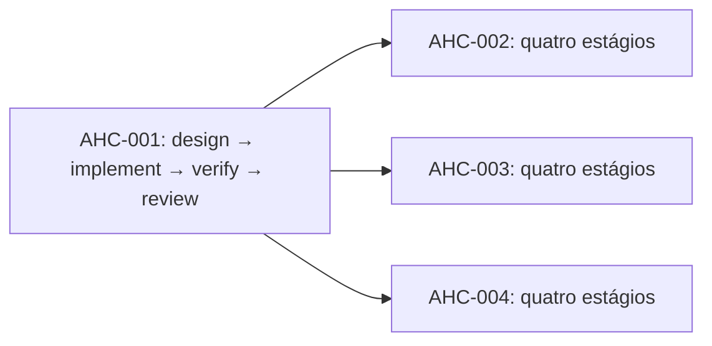

# Sprint 1 — Confiança na entrada e nas evidências

**Estado: proposta.** Timebox sugerido: dez dias úteis. Início, capacidade e
responsáveis ainda precisam ser confirmados. Não há sprint iniciada automaticamente.

**Sprint Goal:** tornar a entrada, o perfil de domínio e as evidências verificáveis,
medindo a confiabilidade da baseline offline.

## Preparação por agentes

O PO solicitou e recebeu uma equipe executável antes desta sprint. Os seis
especialistas preparam análises, planos, matriz de aceitação e riscos; seu relatório
fica em checkpoint para revisão explícita do PO. A aprovação dessa preparação
não inicia a sprint nem conclui as histórias candidatas.

```sh
uv sync --locked --extra team
uv run --extra team factory team run project-definition --output output/pre-sprint-team
```

Consulte [operação da equipe](../engineering/project-agents.md) antes do Planning.

## Sprint Backlog candidato

| História | Resultado demonstrável | Estimativa inicial para discussão |
|---|---|---|
| AHC-001 | Intake com limites, rejeição de duplicatas e diagnósticos | 3 pontos |
| AHC-002 | Perfil de domínio com incerteza e origem explícitas | 3 pontos |
| AHC-003 | Evidence Pack validado e rastreável | 3 pontos |
| AHC-004 | Três domínios de fixtures e benchmark offline | 3 pontos |

Os 12 pontos não representam capacidade conhecida. Se o conjunto não couber,
reduzir escopo no Planning mantendo o objetivo; começar por AHC-001 e pelo menor
incremento de evidências. Critérios completos estão no manifesto do produto.

## Plano técnico verificável

[`planning/sprint-1.json`](../../planning/sprint-1.json) seleciona as histórias.
[`planning/sprint-1.tasks.json`](../../planning/sprint-1.tasks.json) é gerado pelo
planner: quatro estágios por história, total de 16 tarefas.



O grafo produz oito ondas potenciais: quatro para AHC-001 e quatro para as três
histórias dependentes. Isso representa precedência, não execução simultânea garantida.
Critérios e deliverables de cada tarefa estão preservados no JSON para revisão.

```sh
uv run factory tasks project-definition --select ahc-001 ahc-002 ahc-003 ahc-004
uv run python scripts/generate_sprint_plan.py --check
```

## Sequência de entrega sugerida

Primeiro demonstrar AHC-001 com testes negativos. Em seguida, desenvolver domínio
e evidências em contratos revisáveis e ampliar fixtures conforme os contratos
estabilizam. Integrar continuamente; não reservar verificação para o último dia.

Na Review, demonstrar entrada válida, falhas diagnosticadas, incógnitas preservadas,
referências verificadas e medição reproduzível. Apresentar resultados reais da CI.

## Riscos, dependências e exclusões

Principal bloqueio técnico: os contratos de input podem afetar todas as histórias.
Mitigar com proposta pequena e fixtures antes de ampliar campos. Disponibilidade
da equipe é a principal incógnita de planejamento.

Fora desta sprint: integração com LLM, Temporal, banco de dados, API, deploy,
síntese de agentes, otimização de prompts e execução autônoma. Os critérios da
Definition of Done se aplicam a todas as histórias selecionadas.
