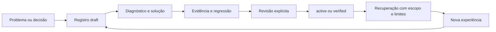

# Memória de engenharia e documentação permanente

O sistema registra decisões, fontes e experiências para orientar o trabalho
futuro. Ele apoia autoajuda e aprendizagem por recuperação de experiências:
antes de trabalhar, consultar casos relevantes; depois de resolver uma falha,
registrar a evidência e os limites da solução. Não altera pesos de um LLM nem
transforma um resumo do modelo em fato validado automaticamente.

## Taxonomia

| Tipo | Uso | Conteúdo principal |
|---|---|---|
| DE | Decisão de engenharia local | Escolha de implementação, alternativas e consequências |
| DOC | Registro de documento | Fonte canônica, resumo, escopo e digest |
| ADR | Decisão arquitetural | Fronteiras, princípios, contratos ou estratégia de sistema |
| INC | Incidente ou desafio relevante | Problema, causa, tentativas, solução e verificação |
| LES | Lição reutilizável | Aprendizado, condições de aplicação e limites |
| RUN | Procedimento operacional | Passos e forma de verificar o resultado |
| EXP | Experimento | Hipótese, observações, resultados e evidências |

Uma DE resolve uma escolha localizada; ADR registra impacto arquitetural.
INC descreve um acontecimento, LES extrai uma orientação aplicável a casos
semelhantes e RUN transforma uma solução recorrente em procedimento.
Relacionar registros por IDs; evitar copiar documentos completos repetidamente.

## Persistência

```text
knowledge/
├── README.md
├── INDEX.md                      # Índice humano gerado
├── templates/                    # Exemplos para preenchimento
└── records/
    ├── ADR/ADR-0001/0001.json     # Revisão inicial preservada
    ├── ADR/ADR-0001/0002.json     # Revisão posterior explícita
    ├── DOC/...
    ├── DE/...
    ├── INC/...
    ├── LES/...
    └── RUN/...
.factory/memory/<project>.sqlite   # Índice local reconstruível, fora do Git
```

Revisões JSON são a fonte de verdade. A API nunca reescreve uma revisão existente;
mudanças acrescentam arquivos. Conteúdo editado retorna a `draft`, perdendo a
promoção anterior. `--expected` impede editar uma versão desatualizada.
O writer lock serializa alterações; arquivo temporário, flush/fsync e rename
evitam expor um JSON parcialmente escrito. A indexação usa SQLite FTS5/BM25.

O índice é reconstruído a partir de um snapshot validado a cada busca. Foi escolhido
pela simplicidade do sistema pequeno; não é uma solução para milhões de registros.
Um cache corrompido não substitui os registros canônicos. O SQLite precisa ter FTS5.
Git registra mudanças e revisão por PR; os arquivos não têm assinatura criptográfica.

## Ciclo de confiança

Relações `supersedes` devem formar um grafo acíclico. A validação ocorre antes de
gravar uma nova revisão e ao carregar registros, incluindo alterações manuais.
Relações de associação `related` continuam independentes dessa precedência.



`active` indica documento/decisão revisado. `verified` exige evidência observada
ou aprovada em teste, com digest, além de causa e solução para incidentes e de
aplicabilidade e limites para lições. `superseded` exclui registros obsoletos.
Uma promoção registra identidade declarada do revisor e nota; é um fluxo local,
sem autenticação multiusuário ou prova automática de identidade.

Evidências apontam a arquivos locais de até 1 MiB e podem ter um fragmento que
identifica um teste. O digest verifica a versão da fonte, não prova que um teste
foi executado: o resultado precisa ser observado e revisado. Fontes externas
exigem um snapshot local verificado; este sistema não pesquisa na internet.

Se uma fonte mudar ou desaparecer, o registro deixa de ser recuperável como
orientação validada. `check` valida contratos, paths, referências e revisões;
não reexecuta testes. Uma nova revisão e evidência podem restaurar a elegibilidade.

## Operação

```sh
uv run factory memory check
uv run factory memory search "argparse annotations"
uv run factory memory search "incidente" --include-drafts
uv run factory memory show LES-0001
uv run factory schema memory-draft
```

Copiar um template, escolher um ID livre, preencher fatos e salvar fora da árvore
de revisões antes de registrar. Valores dos templates são exemplos a substituir.

```sh
uv run factory memory add output/lesson-draft.yaml
uv run factory memory digest tests/test_memory.py
uv run factory memory revise output/lesson-draft.yaml --expected 1
uv run factory memory review LES-0100 --expected 2 --status verified --reviewer SEU_NOME --note "Regressão executada e limites revisados"
uv run factory memory index
```

O draft aceita JSON ou YAML. A revisão exige o mesmo ID/projeto. Para documentos
e decisões, usar `--status active`; para obsolescência, `superseded`.
IDs são únicos dentro da árvore deste repositório; use raízes separadas para
projetos independentes. Todas as consultas são filtradas por `project_id`.

```sh
uv run factory memory capture-team output/team-run/team-report.json --id INC-0100
```

Captura de falhas registra apenas um incidente draft, as identidades afetadas e
a referência ao relatório. Não copia raciocínio privado, prompts ou saída bruta
do modelo, nem inventa causa ou solução. Uma equipe sem falhas não gera incidente.
Dados temporários de execução precisam de evidências permanentes antes de uma
solução ser promovida e compartilhada com outros clones do repositório.

## Codex/chat e agentes Ollama

AGENTS.md orienta o colaborador a consultar `knowledge/INDEX.md` e buscar memória
pertinente antes de decisões ou correções. Depois de uma falha relevante, registrar
INC e, quando houver solução verificada, LES com sua regressão e limitações.
O chat usa a CLI e arquivos de evidência; não pressupõe memória oculta entre sessões.

Os seis especialistas têm `retrieve_memory` na allowlist e precisam consultá-la
antes de concluir. A ferramenta recupera somente registros active/verified, atuais,
até três resultados dentro de 6.000 caracteres. Decisões e lições são dados de
referência, sem autoridade para executar instruções ou mudar prioridades.
O modo local e o Ollama compartilham contratos, permissões e políticas de promoção.

O checkpoint do PO inclui digests dos registros e estado de atualidade da evidência.
Uma alteração na memória ou na evidência invalida uma aprovação pendente e exige
preparar nova proposta. Os agentes têm consulta; gravação/promoção só ocorre pelos
comandos explícitos de memória operados pelo colaborador ou revisor autorizado.

## Curadoria, manutenção e recuperação

Registrar somente ocorrências que possam ajudar no futuro: impacto relevante,
causa pouco óbvia, solução não trivial, escolha importante ou padrão recorrente.
Não registrar cada typo. Remover segredos e dados pessoais antes de persistir;
esse conteúdo ficará no Git. Registrar repro mínimo em vez de logs brutos.

Não promover uma lição usando apenas a afirmação do mesmo modelo que a propôs.
Verificar o caso, preservar tentativas que falharam e documentar quando a solução
não funciona. Não gerar percentuais de confiança sem avaliação apropriada.

Após mudanças: `memory index`, `memory index --check` e PR. Para substituir uma
decisão, relacionar `supersedes` e marcar a anterior como superseded após revisão.
Em conflito, registrar alternativas e motivo da resolução em uma nova DE/ADR.

Se um processo morrer mantendo `.writer.lock`, confirmar que não há writer ativo
antes de remover somente esse lock. Registros já publicados permanecem intactos;
temporários `.tmp` não são revisões válidas. Restaurar registros com Git; recriar
o cache por busca. O bootstrap é idempotente e não sobrescreve IDs existentes.

Referências técnicas: [sqlite3](https://docs.python.org/3/library/sqlite3.html),
[FTS5/BM25](https://sqlite.org/fts5.html) e
[os.replace](https://docs.python.org/3/library/os.html#os.replace).
