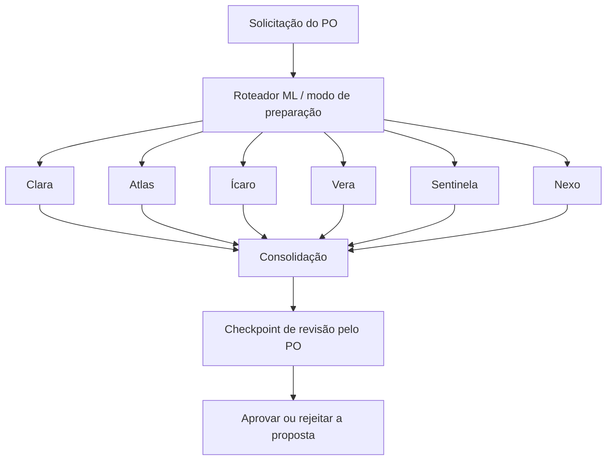

# Equipe executável subordinada ao PO

Esta equipe opera sobre o AI Harness Compiler antes da Sprint 1. Personas são
contratos tipados em `team/personas.py`; agentes executam ferramentas em
`team/agents.py`; coordenação e aprovação persistente usam LangGraph em
`team/runtime.py`. O código do compilador permanece independente desses frameworks.

| Agente | Persona e responsabilidade | Ferramenta obrigatória / entrega real |
|---|---|---|
| Clara | Analista precisa, questionadora; requisitos e critérios | Auditoria de histórias, I/O e ownership não declarados |
| Atlas | Arquiteto conservador com complexidade; contratos e escala | Mapeamento de mudanças a módulos e gates de compatibilidade |
| Ícaro | Engenheiro incremental; precedência técnica | TaskGraph validado e ondas de dependência |
| Vera | Qualidade cética com alegações de sucesso | Matriz de aceitação e inventário de funções de teste por AST |
| Sentinela | Segurança atenta a limites de confiança | Riscos declarados e permissões do runtime |
| Nexo | Coordenador objetivo; Scrum e impedimentos | Proposta de entrega com capacidade e decisões pendentes |

Todos respondem ao PO humano. São especialistas de preparação e análise do
projeto; a ferramenta do engenheiro produz o plano de implementação. Alterar
código, executar testes arbitrários, publicar ou mudar prioridades não está
exposto nas permissões desta equipe inicial.

## Instalar e executar

```sh
uv sync --locked --extra team
uv run --extra team factory team list
uv run --extra team factory team run project-definition --output output/pre-sprint-team
```

Os seis agentes executam em fan-out, suas observações são consolidadas em fan-in
e o grafo pausa para o PO. A saída contém `team-report.json`, `tasks.json`,
`run.json` e `checkpoints.sqlite`. O último contém a execução persistida.
Use uma pasta nova a cada proposta. Os resultados não iniciam a sprint.



## Modos de inteligência

**Local:** políticas de decisão determinísticas escolhem ferramentas reais e
produzem entregas estruturadas, usando ML para roteamento e recuperação de contexto.
É adequado à execução offline de preparação. A persona fornece identidade e
restrições, sem fingir raciocínio generativo onde há código determinístico.

**Ollama:** um LLM local escolhe ferramentas em um ciclo limitado e gera um resumo
consultivo. O runtime valida decisões com Pydantic, exige ferramentas de evidência
e aplica permissões fora do modelo. A instalação de Ollama e de um modelo é
pré-requisito externo; o projeto não baixa modelos automaticamente.

```sh
uv run --extra team factory team run project-definition --output output/team-llm --engine ollama --model SEU_MODELO_INSTALADO
```

O endpoint é fixo em `127.0.0.1:11434`; timeout de 30 segundos por chamada e limite
de 3 a 10 passos por agente. Só usar um modelo que suporte as saídas estruturadas
exigidas. As falhas interrompem o agente e bloqueiam a aprovação da execução.
O contrato HTTP e o ciclo com ferramentas são testados com transport fixtures;
uma validação com um modelo instalado precisa ser registrada separadamente.

## Pedir uma análise específica

```sh
uv run --extra team factory team run project-definition --mode ask --request "Audite segurança, permissões e dados privados" --output output/security-review
```

Em `prepare`, executam os seis papéis. Em `ask`, um classificador supervisionado
TF-IDF + LogisticRegression seleciona um papel. Se o vocabulário for desconhecido
ou o score não alcançar o limite, registra abstenção e encaminha ao coordenador.
Scores são probabilidades não calibradas, sem equivaler a confiança factual.

## Avaliação de ML

```sh
uv run --extra team factory team evaluate-ml
```

O corpus versionado em `team/ml.py` possui 36 exemplos de treino e 12 de holdout,
em português e inglês, com separação de textos. Na validação inicial, acertou os
12 exemplos. Esse resultado descreve somente o conjunto curado pequeno.
Antes de uso amplo, coletar pedidos reais rotulados pelo PO, ampliar holdout,
avaliar abstenções/calibração e medir erro por papel sem otimizar no teste.

O contexto usa outra representação TF-IDF para recuperar até três trechos de
2.000 caracteres de fontes permitidas. Cada arquivo tem limite de 128 KiB;
paths que escapam da raiz são rejeitados. `.env` e diretórios arbitrários não são
fontes acessíveis. A recuperação é lexical; não é um modelo de embeddings semânticos.

## Decisão do PO e limites de execução

Após revisar o JSON, o PO registra uma decisão explícita:

```sh
uv run --extra team factory team review output/pre-sprint-team --decision approve --comment "Aceito o pacote de preparação; capacidade será definida no Planning."
```

Trocar `approve` por `reject` para rejeitar. A decisão aceita/rejeita a proposta,
sem marcar histórias Done, escrever no repositório ou iniciar sprint. O checkpoint
retoma sem executar novamente os especialistas. Revisão repetida, execução com
falhas ou mudança das fontes de contexto exige uma nova proposta.

Este é um fluxo local sob controle do proprietário do workspace; não há autenticação
multiusuário. Checkpoints devem ser tratados como dados privados de execução, sem
versioná-los. LangSmith tracing é desabilitado explicitamente; modo local não
requer serviço externo. Resumos de LLM são consultivos, e resultados de qualidade
continuam `not-run` quando a ferramenta apenas inspeciona planos e testes existentes.

Referências: [LangGraph Graph API](https://docs.langchain.com/oss/python/langgraph/graph-api),
[interrupts](https://docs.langchain.com/oss/python/langgraph/interrupts),
[scikit-learn TF-IDF](https://scikit-learn.org/stable/modules/feature_extraction.html),
[LogisticRegression](https://scikit-learn.org/stable/modules/linear_model.html#logistic-regression),
[Ollama chat](https://docs.ollama.com/api/chat).
