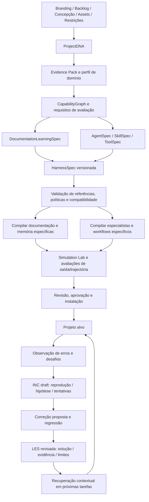

# Pipeline de geração por projeto

Decisão de produto confirmada pelo PO em 2026-10-06: o compilador deverá gerar,
para cada projeto alvo, o sistema de documentação/aprendizado e agentes aprofundados.
As implementações atuais de equipe e memória no próprio compilador são referências
executáveis para essa capacidade; a geração adaptada para projetos alvo continua planejada.

## Pipeline alvo

## Sistema de documentação e aprendizado gerado

DocumentationLearningSpec deve determinar taxonomia, idioma, vocabulário de domínio,
ownership, ciclo de revisão, políticas de retenção/redação, confiança e atualidade,
orçamento de contexto, isolamento e adapters permitidos.

O bundle deverá incluir biblioteca executável de registros, schemas, revisões,
templates de domínio, índice, bootstrap de decisões rastreáveis, consultas e captura
de experiências. AGENTS.md e os prompts/adapters de runtime deverão apontar para o
mesmo protocolo de memória, com carregamento sob demanda.

INC registra ocorrência e tentativas. LES transforma uma solução verificada em
orientação com contexto de aplicação e limites. DE/ADR registram as decisões que
explicam a solução, DOC aponta às fontes, RUN formaliza procedimentos recorrentes
e EXP mede alternativas. Um erro recorrente pode motivar uma skill ou meta-tool
somente após avaliação e revisão da proposta.

Registros iniciais vêm de fontes do projeto e decisões justificadas. O compilador
não pode inventar incidentes resolvidos ou marcar exemplos sintéticos como aprendizado
comprovado. Memória e índice são separados; atualização detecta conflito e preserva
histórico. Licenças e atribuições acompanham código/templates incorporados.

## Agentes aprofundados

Um agente especializado precisa de competências de domínio verificáveis, contratos
de entrada/saída, ferramentas concretas, skills, contexto e memória relevantes,
fronteiras de responsabilidade e critérios de qualidade. Persona é uma dimensão
desse contrato, junto de modelo, planejamento/delegação, budgets, stop conditions,
permissões, supervisão humana e avaliação.

O registry de agentes gerados será extensível: os seis papéis da equipe atual não
são uma enumeração universal para todos os produtos. LangGraph, MCP, providers e
ML serão adapters selecionados conforme necessidade e evidências. O core conserva
sua IR e pode gerar workflows sem agentes.

Exemplos de diferenças a demonstrar nas fixtures:

| Projeto | Conhecimento e memória | Especialista / ferramenta concreta | Avaliação |
|---|---|---|---|
| Educação | Fontes didáticas, objetivos, revisão pedagógica | Revisor de aula / validar referências e objetivos | Fundamentação, adequação e revisão humana |
| Comércio | Catálogo, estoque, regras de preço e eventos | Especialista em catálogo / validar dados e disponibilidade | Consistência, tool correctness e efeitos autorizados |

Esses são casos planejados para testes, não funcionalidades implementadas hoje.
Dados reais precisam de consentimento e controles de privacidade específicos.

## Evidência de sucesso e gates

1. Especificar e validar políticas antes de gerar arquivos.
2. Compilar dois domínios com diferenças rastreáveis e um caso válido de zero agentes.
3. Executar tarefas reais/representativas com baseline e datasets reservados.
4. Medir correção de saída e trajetória, ferramentas, custo, latência e isolamento.
5. Testar captura de falha, regressão, promoção de lição e recuperação numa tarefa seguinte.
6. Aprovar adoção com diff, migração, rollback e evidências disponíveis.

Aprendizado por experiências recuperadas é a primeira modalidade. Otimização de
prompts ou treinamento de modelos é um experimento separado, com dataset adequado,
holdout, regressão, budgets e autorização. Compartilhar experiências entre projetos
exige anonimização, direitos de uso, compatibilidade e revisão de aplicabilidade.

## Entrega incremental

| História | Marco | Resultado |
|---|---|---|
| AHC-015 | M2 | Contrato DocumentationLearningSpec e políticas por domínio |
| AHC-016 | M2 → M3 | Compilador e biblioteca de memória do projeto alvo |
| AHC-017 | M2 → M3 | AgentSpec e especialistas executáveis avaliáveis |
| AHC-018 | M3 → M5 | Captura, revisão, recuperação e evolução por experiências |

A Sprint 1 continua com AHC-001 a AHC-004. Os novos itens entram no Product Backlog
e dependem dos contratos/evidências dessa fundação; não são marcados Done pela
existência da equipe ou memória interna do compilador.
